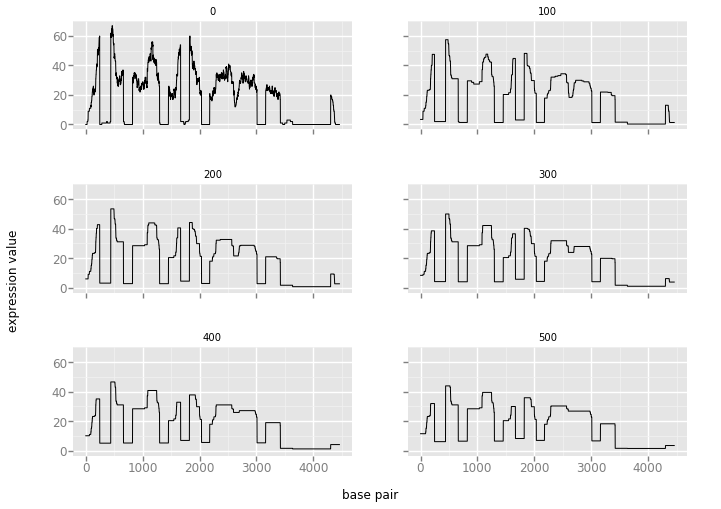
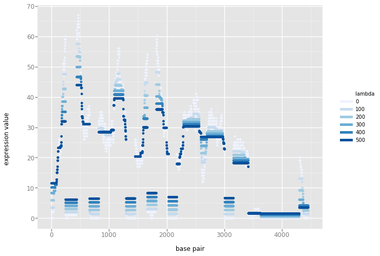

# `tv1d`

[](https://crates.io/crates/tv1d) [](https://docs.rs/tv1d/) [](https://travis-ci.org/jeenalee/tv1d/)

Total variation denoising algorithms for 1d data.

## Total Variation Denoising

[Total variation (TV) denoising](https://en.wikipedia.org/wiki/Total_variation_denoising) removes fine, potentially spurious noise from a discrete signal while preserving its sharp edges. The technique is well-suited for recovering piecewise constant signals and is often favored for denoising images over alternatives that would smooth edges.

## Install

Add this to your `Cargo.toml`:
```toml
[dependencies]
tv1d = "0.1.0"
```

## Example Usage

``` rust
extern crate tv1d

fn main() {
    let input = vec![13.0, 24.3, 63.41, 13.6];
    let lambda = 3.0;

    let output = tv1d::condat(&input, lambda);
}
```
## Documentation

Read the [documentation on Docs.rs](https://docs.rs/tv1d).

## License

This crate is licensed under MIT license ([`LICENSE`](./LICENSE)).

## Using Rust crate from other languages

Please check out the Rust Book's chapter ["Rust Inside Other Languages"](https://doc.rust-lang.org/1.2.0/book/rust-inside-other-languages.html).

## Contribution

See [CONTRIBUTING.md](./CONTRIBUTING.md)!

## Denoising Example

Following is a visualization of `tv1d::condat` with varying `lambda` applied to [Human Death-associated protein 6 (DAXX)](https://en.wikipedia.org/wiki/Death-associated_protein_6) [transcript variant 1](https://www.ncbi.nlm.nih.gov/nuccore/NM_001141969) expression data from [UCSC Human Genome](https://genome.ucsc.edu/cgi-bin/hgGateway) database.

"base pair" denotes the position at the transcript. "expression value" denotes the level of expression at a given "base pair" after denoising. "lambda" is the degree of denoising applied to the signals, and `0` is the raw signals.

The plots were generated with [`ggpy`](https://github.com/yhat/ggpy).


<br>

